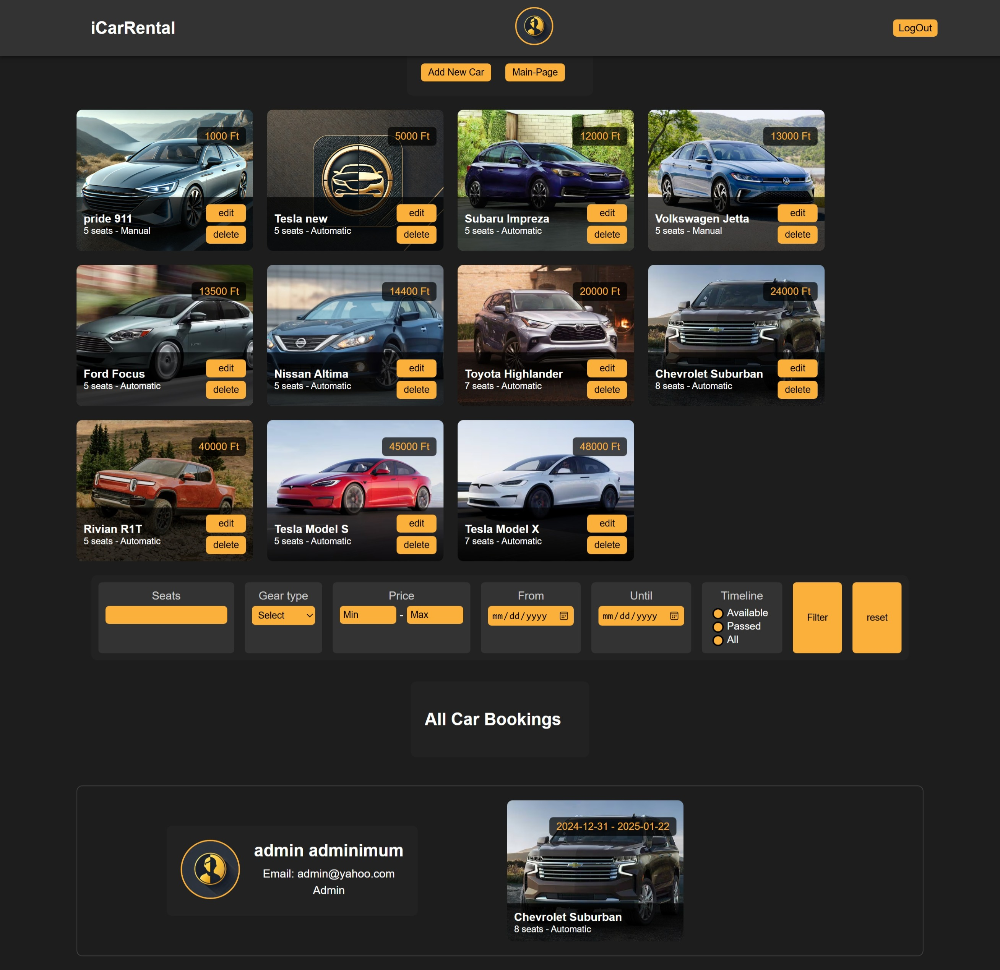
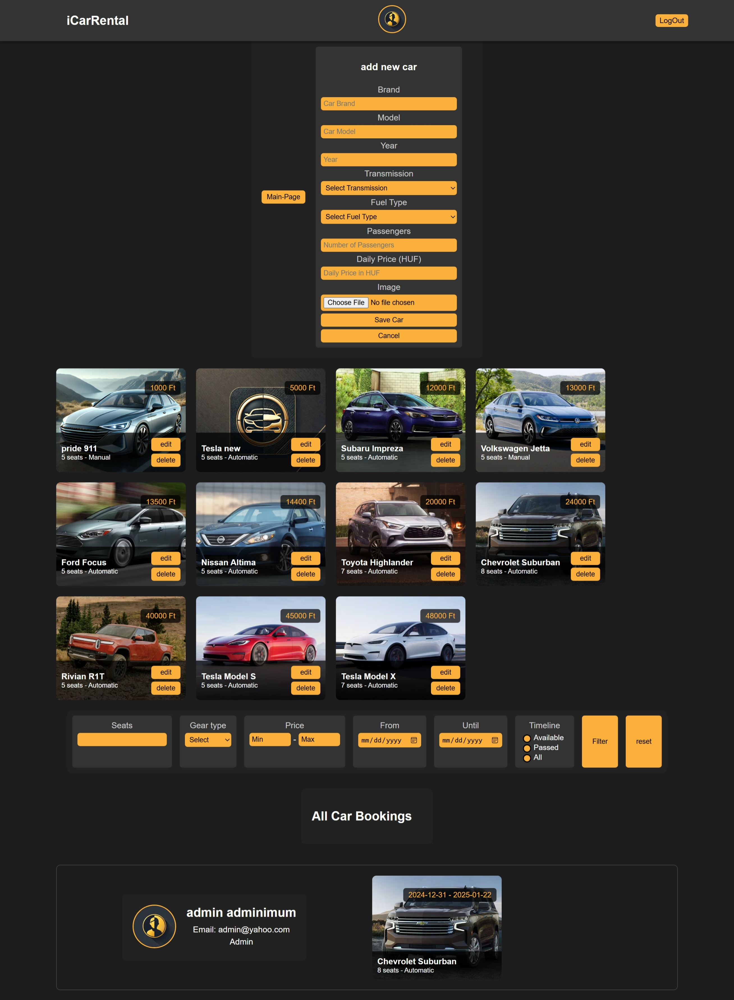
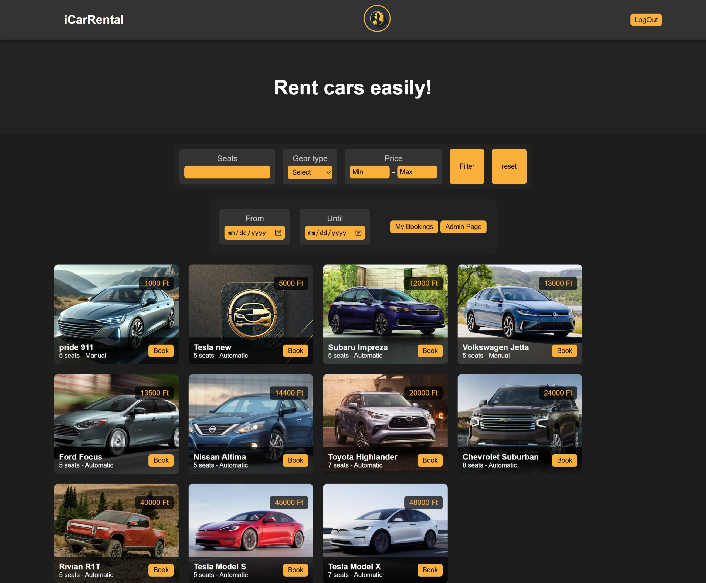
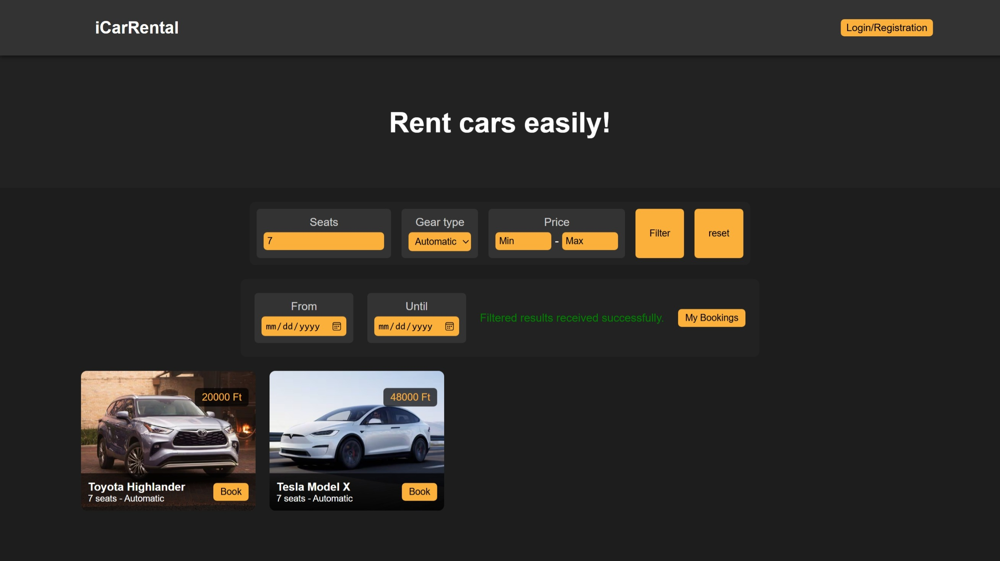
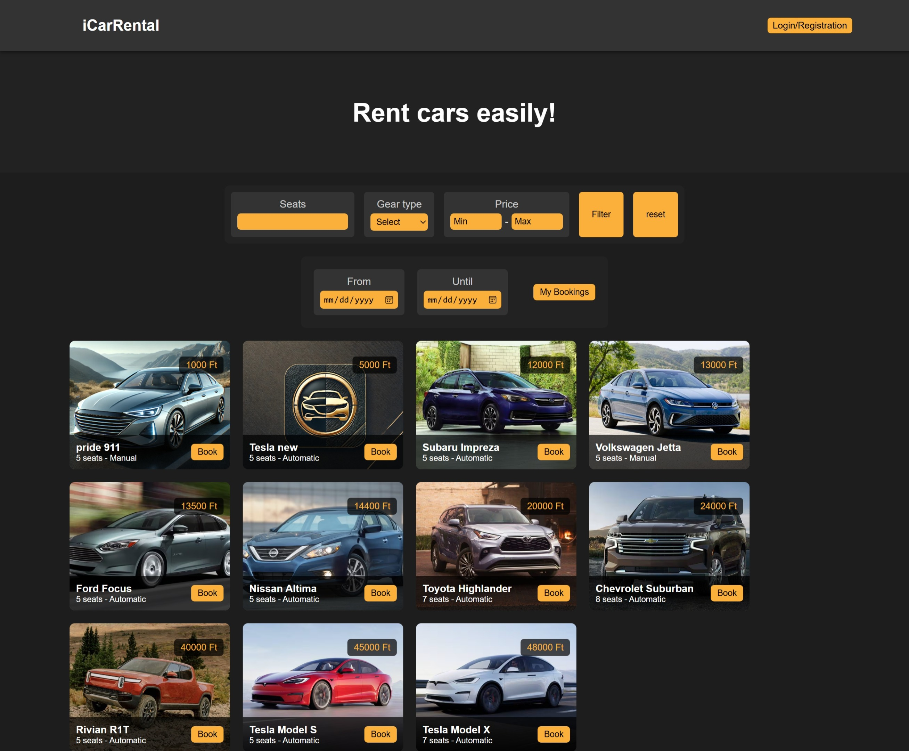
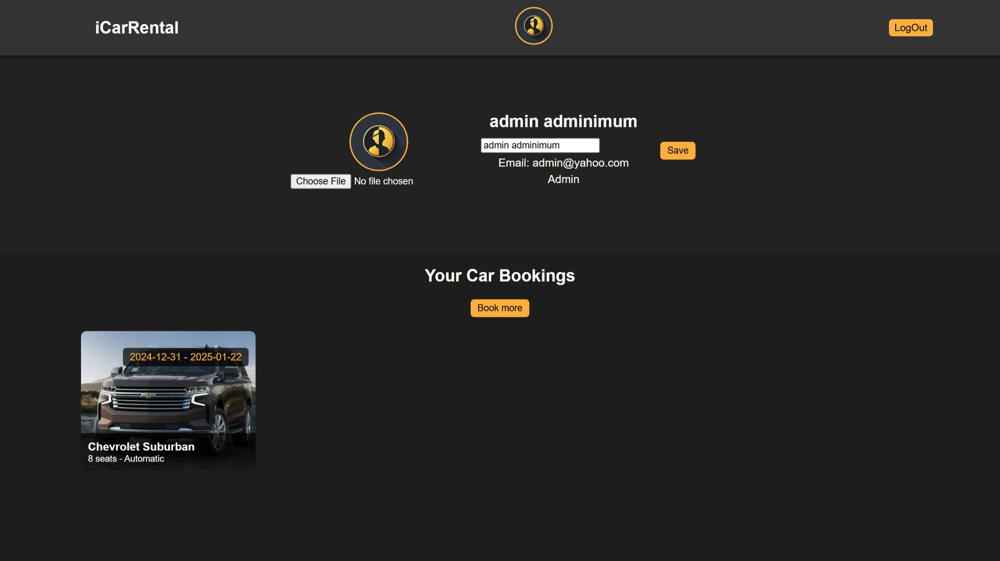
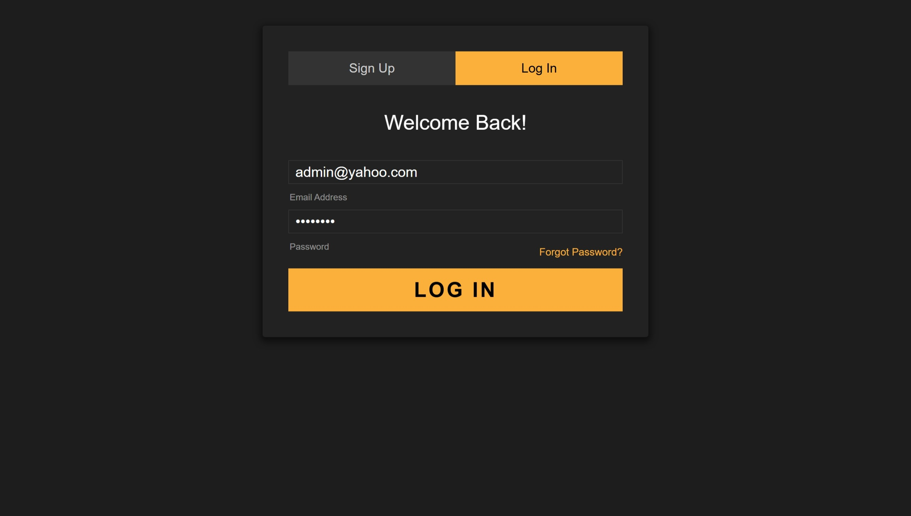
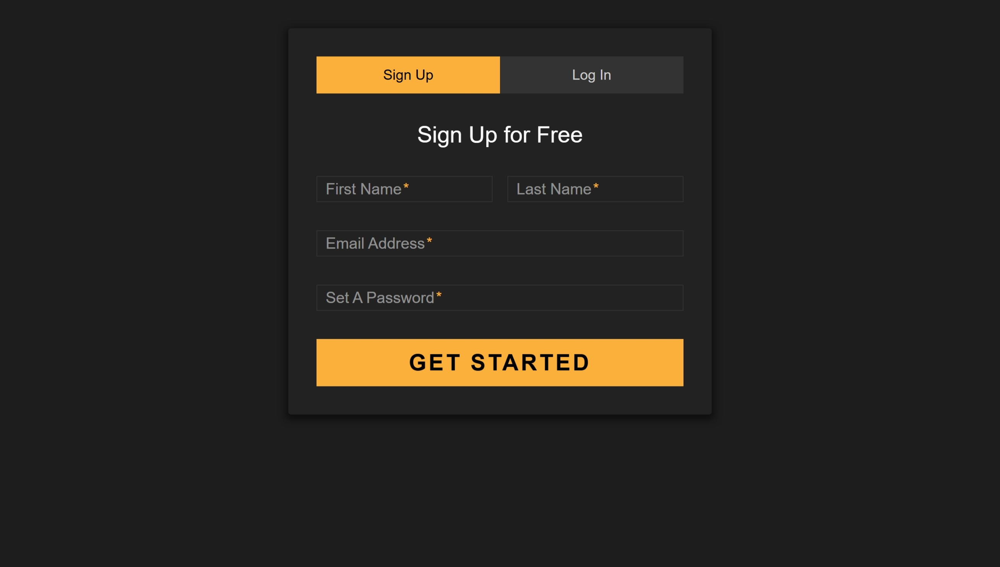

# 🚗 iCarRental

## 🧾 Overview

## 🧾 Overview

## 🧾 Overview

iCarRental is a dynamic, interactive car rental platform  
crafted with **vanilla PHP**, **HTML**, and **JavaScript**,  
developed during Semester 3 of the Web Programming course at ELTE.

It combines full **CRUD functionality**,  
**user authentication**,  
a powerful **admin dashboard**,  
**AJAX-powered bookings**,  
and seamless **image upload/editing** —  
all wrapped in a responsive and intuitive interface.

Whether you're booking your next ride or managing a fleet,  
this project delivers a complete, lightweight rental experience — no frameworks required.

---

## 📸 Screenshots

### 👨‍💼 Admin Panel
- Admin Dashboard  
  
- Add New Car  
  
- Edit Car Info  
  

### 👤 User View
- Landing Page (Admin View)  
  
- Landing Page (Filtered)  
  
- Landing Page (Normal User)  
  
- User Edit Info Page  
  

### 🔐 Auth Pages
- Login Page  
  
- Signup Page  
  


---

## 💡 Features

### ✅ Minimum Requirements
- Homepage lists all cars with their basic attributes.
- Clicking on a car leads to a detailed page with full attributes and image.
- Homepage filters support all required criteria (including date range).
- Admin can create new cars with validation and error handling.
- Admin changes do **not** require login but must not be tampered with manually in `data/users`.

### 🔐 Authentication
- User registration with error handling.
- User login with validation and state tracking.
- After login, UI shows logged-in status.
- Logout available globally.

### 📅 Booking System
- Car bookings for specific dates (stored upon success).
- Users see success/failure messages with booking info.
- Profile page shows personal booking history.
- Admin profile page shows all bookings with delete options.

### 🛠 Admin Functions
- Admin can:
  - Create, edit, and delete car entries.
  - View and delete all bookings.
- Admin credentials (hardcoded for testing):
  - Email: `admin@yahoo.com`
  - Password: `admin123`
- Admin access starts from the homepage UI.

### 🎨 Design
- Polished, mobile-responsive layout.

### ✨ Bonus Features
- Booking calendar allows only available dates to be selected.
- Booking confirmation is done via AJAX (modal-based, no page refresh).

---

## 🧭 Project Structure

```
index.php               # Main landing and car listing page
details.php             # Detailed car view and booking
/admin/                 # Admin interface
/auth/                  # Login & signup
/data/                  # Persistent storage for cars, users, bookings
/scripts/               # JavaScript handlers for dynamic features
```

---

## 🚀 Run Locally

You can run this project with either a local PHP server or using XAMPP/MAMP.

### 🧪 Option 1: PHP Built-in Server (Quick Test)

```bash
php -S localhost:8000
```

Then go to:  
👉 `http://localhost:8000/index.php`

Make sure you're in the root directory where `index.php` exists.


---

## 📚 University Info

🎓 Student: Saeed Khanloo  
🧠 Course: Web Programming  
🏫 Institution: ELTE (Eötvös Loránd University)  
🗓️ Semester: 3  
🪪 License: MIT
